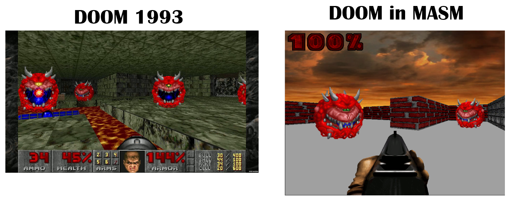

# DOOM in MASM

用 Microsoft Assembly 实现一个类似于 DOOM 1993 的第一人称 3D 射击游戏。

### 编译/运行

直接在 Windows 下运行`exe/doom.exe`

或者用 Visual Studio 2012/2022 打开项目，点击”生成解决方案“后，将`utils/`下的所有文件复制粘贴到`Debug/`文件夹下，然后直接在文件夹中双击运行`Project1.exe`即可。

> 若要使用Visual Studio 2012/2022 中的”启动调试“或”开始执行(不调试)“功能，请将`utils/`下的所有文件复制粘贴到`Project1/`文件夹下。

### 参考资料

[Get Started with Win32 and C++ - Win32 apps | Microsoft Learn](https://learn.microsoft.com/en-us/windows/win32/learnwin32/learn-to-program-for-windows)

[Programming reference for the Win32 API - Win32 apps | Microsoft Learn](https://learn.microsoft.com/en-us/windows/win32/api/)

[Ray-Casting Tutorial – permadi.com](https://permadi.com/1996/05/ray-casting-tutorial-table-of-contents/)

[Creating a DOOM-style 3D Game in Python from Scratch. Pygame Tutorial - YouTube](https://www.youtube.com/watch?v=ECqUrT7IdqQ)