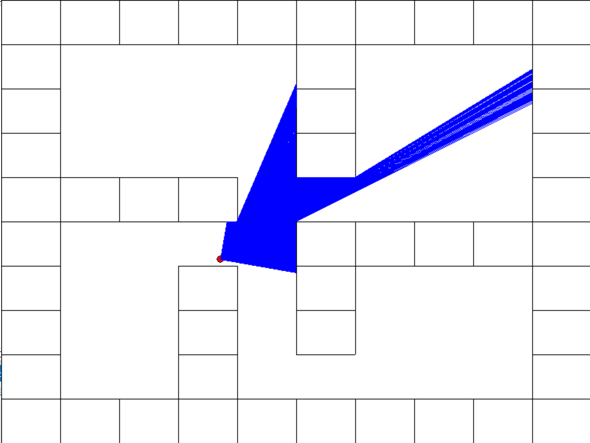

# 汇编小组作业——DOOM-Like游戏

> 和嘉晅 徐浩博 董文冲

我们在 Microsoft Assembly 中实现了一个类似于 DOOM 1993 的 3D 射击游戏。

## 开发环境

- Windows 10/11
- Visual Studio 2012/2022
- MASM 32
- 无第三方库

## 实现原理

### 模块化

除了入口程序 `main.asm` 以外，其它模块都由 `.inc` 文件加 `.asm` 文件组成，其中 `*.inc` 是头文件，只描述了外部可以调用的函数接口以及数据，`*.asm` 则是模块的具体实现。

> 例如 player 模块包含 player.inc 和 player.asm，在 player.inc 中定义了 `DrawPlayer` 函数供渲染过程调用，player.asm 中包含了 DrawPlayer 的实现，以及一些模块的私有函数与私有数据。

### 使用 GDI 接口在窗口上绘图

MASM 32 提供了 `gdi.inc` 与 `gdi.lib`，包含了 [Windows graphics device interface](https://learn.microsoft.com/en-us/windows/win32/gdi/windows-gdi) (GDI)。GDI 是 Window 提供的低级绘图接口，提供了若干接口用于绘制画面：

- `MoveToEx` + `LineTo`：在屏幕上绘制一条直线
- `StretchBlt`：将内存中的一个 Bitmap 绘制到屏幕上的一个矩形上
- `TransparentBlt`：将一个 Bitmap 绘制到屏幕上的一个矩形上，该 Bitmap 用一个特定的 RGB 值给出是否透明的信息（类似于绿幕）

### 以固定频率重绘窗口

为了让游戏以固定的频率重新渲染画面（重绘窗口），我们使用了 [SetTimer](https://learn.microsoft.com/en-us/windows/win32/api/winuser/nf-winuser-settimer) 函数，每隔一个固定的时间发送一个 `WM_TIMER` 消息。每当 Message Loop 收到 `WM_TIMER` 消息时都会调用 `DrawMain` 绘制一帧的画面。

### 简易版 Ray Casting 算法

我们使用了老 DOOM 中的简易版（或者说伪 3D）Ray Casting 算法来绘制画面，这个算法从玩家视角发出射线，检测与墙体或怪物的碰撞，并根据射线经过的距离将图像以正确的大小投影到屏幕上。由于该算法假设了玩家的视线平行于地面，玩家视角只能左右移动，因此发射一条射线即可绘制一列画面，计算成本可以接受。

### 播放音乐与音效

使用 `winmm.inc` 中提供的 [PlaySound](https://learn.microsoft.com/en-us/previous-versions/dd743680(v=vs.85)) 函数，播放 `.wav` 格式的音频作为背景音乐。

播放音效的难点在于当多次调用 PlaySound 时，在播放的只有最后一次调用的结果，每次调用都会使前一次播放失效。在对比使用第三方库和自己实现 mixer 的技术难度之后，我们没有选择这两者，而是选择了一条更取巧但对我们的项目来说最实用的解决方案：在需要播放音效时，另开一个进程单独播放小音效。

我们为玩家受攻击、玩家死亡、武器开火、怪物受攻击、怪物死亡、怪物进行攻击等多个事件添加了复古风格的音效。

### 贴图

考虑在上述 Ray Casting 的基础上在墙面加上贴图：由于贴图的长宽与位置都已知，其难点主要在于计算墙体图片的 offset，即计算出屏幕上一条贴图带应当位于原图的什么偏移位置。offset 的计算同样依赖于 ray-casting 计算出的 ray 与墙体的交点坐标，offset 可通过交点坐标在游戏棋盘大格上的偏移量计算得出。

除了墙面，我们还需要处理怪物的贴图，然而这就需要正确获知渲染墙体/怪物之间的遮挡关系，才能最终实现 3D 渲染。为此，我们在 MASM 32 中手动实现了一套快速排序算法，将每一帧的所有待渲染物体按照与玩家的距离从远到近渲染。

类似地，对于不同的墙体、怪物动画、武器动画与 UI 界面，我们均用贴图技术实现。

### 自定义地图

从文件读取二维数字矩阵作为地图，玩家可以制作自定义地图。

- 0 表示空地
- 1,2,3 表示不同贴图的墙体
- 5 表示玩家出生点
- 7,8,9 表示不同贴图不同血量怪物

支持多张地图的加载，当一张地图的所有怪物死亡后进入下一张地图，进入下一张地图后有 1 秒时间显示“NEXT STAGE”提示，没有下一张地图则提示胜利“VICTORY”。

文件以地图数量开头，之后每张地图先是描述长宽的两个数字，之后是长×宽个数字描述地图详情。地图中至少要有一个怪物；可以没有玩家出生点，若为第一张地图则为默认位置，其他地图没有出生点则保留上一张地图的位置，这可能会导致到达边界之外或卡在墙里，因此建议提供一个位置，多个 5 以最后一个为准。具体样例请见 map.txt 文件。

### 寻路算法

为了让怪物更具攻击性，我们使用 BFS 搜索怪物与玩家之间的最短路，并根据回溯的结果为每个怪物选择每一帧的移动方向。

### 动画

使用状态机建模行为，并在合适的时机改变怪物/武器的贴图，即可实现动画效果。例如：

- 怪物
  - 移动时，根据怪物移动方向与玩家的夹角，在 8 个角度的贴图中选择最接近正确角度的贴图
  
  - 
  
  - 受到攻击时，将贴图短暂切换成受伤的贴图
  
  - 攻击玩家时，贴图切换为攻击的贴图
  
  - 死亡后，切换为死亡的贴图并不再改变
  
    
  
- 武器：开火时，连续快速切换开火的 5 张贴图

### 怪物/玩家血量与胜负条件

- 玩家血量：当一个怪物与玩家的距离小于某个阈值时，扣除玩家的血量
  - 游戏开始的 200 帧内玩家不会扣除血量
  - 每当玩家受伤时，玩家都会获得一定时长的无敌帧
- 玩家血量为 0 时游戏结束，用贴图展示 The End 画面
- 当玩家消灭当前关卡的所有怪物时，用贴图展现一段时间 Next Stage 画面
- 当玩家消灭最终关卡的所有怪物时，游戏胜利，用贴图展现 Victory 画面
- 怪物血量：当武器开火时，先判断开火角度，再用 Ray Casting 算法发射射线，检测武器能否能在击中墙壁前击中怪物，若击中则扣除血量并判定是否死亡
  - 怪物死亡后不再移动，也不能再给玩家造成伤害

## 技术难点/创新

### 画面闪烁问题

在开发的过程中遇到了画面闪烁的问题。查阅资料并分析后发现是一帧画面中绘制的时间差引起的：上述 Ray Casting 算法一帧画面需要调用 `WINDOW_WIDTH` 次 `DrawLine`，这些 `DrawLine` 的绘制存在时间差，导致画面闪烁。

为了解决画面闪烁问题，我们引入了**双重缓冲区**：每一帧绘制，使用 [CreateCompatibleDC](https://learn.microsoft.com/en-us/windows/win32/api/wingdi/nf-wingdi-createcompatibledc) 与 [CreateCompatibleBitmap](https://learn.microsoft.com/en-us/windows/win32/api/wingdi/nf-wingdi-createcompatiblebitmap) 函数在内存中创建一个缓冲区，所有的绘制（`DrawLine`）都只更改这个内存中的缓冲区。一帧的所有绘制完成后，用 [BitBlt](https://learn.microsoft.com/en-us/windows/win32/api/wingdi/nf-wingdi-bitblt) 将内存缓冲区的内容全部复制到显示缓冲区，把缓冲区中的所有内容一次全部送到显示设备。

### 鼠标/键盘输入

为了让用户可以按 WASD 移动、用鼠标旋转视角，我们需要处理用户的鼠标与键盘输入。我们没有在 Message Loop 中监听 `WM_KEYDOWN` 和 `WM_MOUSEMOVE` 事件，而是每帧主动读取设备状态。

- 键盘：使用 [GetAsyncKeyState](https://learn.microsoft.com/en-us/windows/win32/api/winuser/nf-winuser-getasynckeystate)，判断当下某个按键是否被按下
- 鼠标：在程序启动时使用 [ShowCursor](https://learn.microsoft.com/en-us/windows/win32/api/winuser/nf-winuser-showcursor) 隐藏鼠标，并用 [SetCursorPos](https://learn.microsoft.com/en-us/windows/win32/api/winuser/nf-winuser-setcursorpos) 将鼠标的位置设定在窗口的正中央。每一帧用 [GetCursorPos](https://learn.microsoft.com/en-us/windows/win32/api/winuser/nf-winuser-getcursorpos) 获得鼠标的坐标，计算其相对于窗口的正中央的偏移量用于移动视角，并调用 [SetCursorPos](https://learn.microsoft.com/en-us/windows/win32/api/winuser/nf-winuser-setcursorpos) 将鼠标的位置重置为窗口的正中央

### 浮点计算

Ray Casting 算法中涉及到大量的浮点计算，我们学习了教材描述对于 FPU 寄存器栈计算模型。除此之外还使用了 3 个教材上未提及的 FPU 计算指令：

- `FSIN`：用 $\sin(ST(0))$ 替换 $ST(0)$
- `FCOS`：用 $\cos(ST(0))$ 替换 $ST(0)$
- `FPATAN`：计算 `atan(ST(1) / ST(0))`

### 创建隐藏窗口的新线程

最初我们使用的是 `/SUBSYSTEM:CONSOLE` 链接子系统的 MASM 程序，在其中调用 `GetConsoleWindow` 获取控制台 handler，然后调用 `ShowWindow` 提供参数 SW_HIDE 隐藏窗口，但是这种方法不能隐藏 Windows 11 的默认终端，并且会导致游戏窗口焦点丢失。

经过调研后我们改用 `/SUBSYSTEM:WINDOWS` 链接子系统，且不使用 `CreateWindow` 函数创建窗口。这样创建的新进程可以完美地在后台运行。

### 计算贴图偏移量

原始版本的RayCasting是模拟光线传播过程一格格推进；然而贴图需要计算光线照射到墙体在墙块上的偏移量，一格对于偏移量来说粒度过大，可能会导致渲染失真的情况。为此，我们从几何计算出发，通过三角关系计算直接获取渲染参数，跳过了光线推进的过程，一是提高了计算速率，二是使得渲染参数更加精确。

然而三角关系计算存在许多困难，一是汇编语言直接进行浮点运算较为困难，这一点在上面已有提及；二是三角计算分类情况较多，对于汇编来说尤其麻烦。因此，我们先进行了条件分支的合并，尽可能减小讨论情况的个数；其次，我们将一部分计算用python语言先行实现，并反复进行测试，在保证正确的情况下比照python代码编写汇编代码，从而提高了开发效率。

## 小组分工

| 成员   | 工作                                                         |
| ------ | ------------------------------------------------------------ |
| 和嘉晅 | 基础框架，初版 Ray Casting，BFS 寻路算法，射击/怪物行走动画  |
| 徐浩博 | 优化/带贴图的 Ray Casting，射击判定，更多怪物，开始/结束界面 |
| 董文冲 | 背景音乐，武器/怪物/玩家等音效，怪物血量/受击，地图读取与切换 |

## 参考资料

[Get Started with Win32 and C++ - Win32 apps | Microsoft Learn](https://learn.microsoft.com/en-us/windows/win32/learnwin32/learn-to-program-for-windows)

[Programming reference for the Win32 API - Win32 apps | Microsoft Learn](https://learn.microsoft.com/en-us/windows/win32/api/)

[Ray-Casting Tutorial – permadi.com](https://permadi.com/1996/05/ray-casting-tutorial-table-of-contents/)

[Creating a DOOM-style 3D Game in Python from Scratch. Pygame Tutorial - YouTube](https://www.youtube.com/watch?v=ECqUrT7IdqQ)
