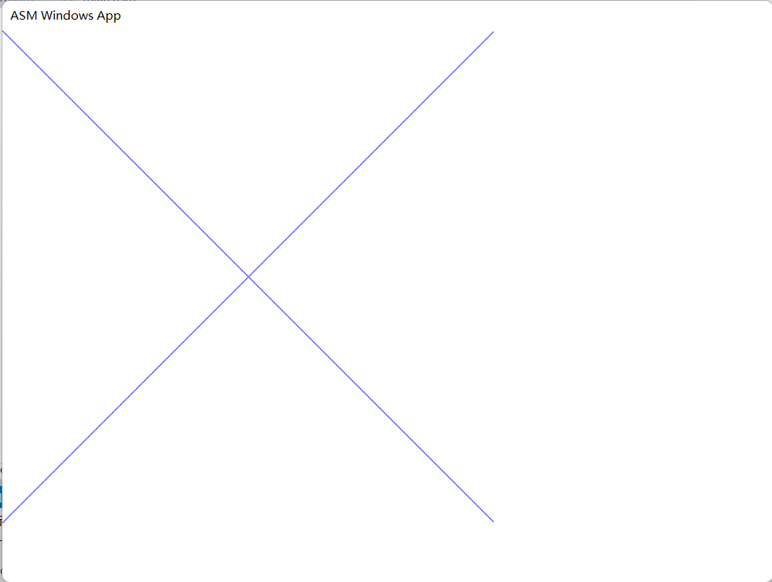
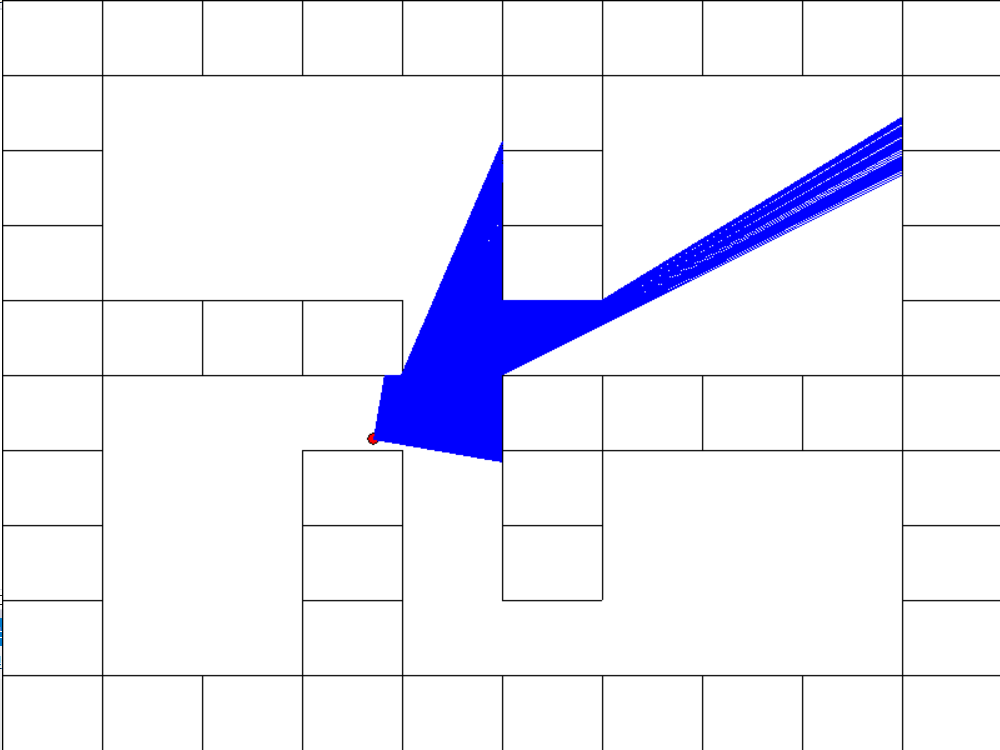
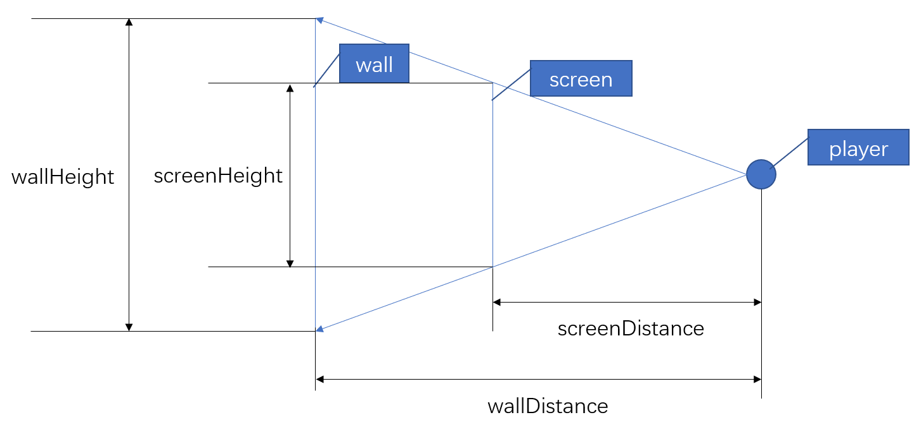
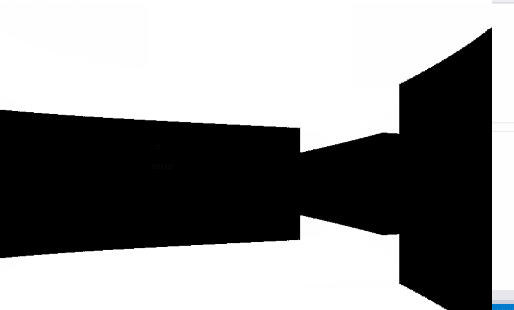

# 中期报告——DOOM-Like游戏

> 和嘉晅 徐浩博 董文冲

## 项目简介

（结合视频/图片，简单介绍）

## 开发环境

- Windows 11 21H2
- Visual Studio 2012
- MASM 32

## 实现原理

### 模块化

除了入口程序`main.asm`以外，其它模块都由一个`.inc` 文件加`.asm`文件组成，其中`*.inc`是头文件，只描述了外部可以调用的函数接口以及数据，`*.asm`则是模块的具体实现。

> 例如 player 模块包含 player.inc 和 player.asm，在 player.inc 中定义了`DrawPlayer`函数供渲染过程调用，player.asm 中包含了 DrawPlayer 的实现，以及一些模块的私有函数与私有数据

共包含以下几个模块：

- `main.asm`：Win32 程序入口，负责创建图形窗口，维护[Window Message Loop](https://learn.microsoft.com/en-us/windows/win32/winmsg/using-messages-and-message-queues#creating-a-message-loop)，并且每隔一个固定的间隔，调用`draw`模块的`DrawMain`函数绘制一帧的画面
- `draw`：绘制一帧的画面，向其它模块提供`DrawLine`接口用于在窗口上绘制RGB彩色的线条
- `player`：维护 player 的状态（位置、朝向）并绘制
- `map`：绘制地图（墙面）
- `config`：窗口大小，FPS，FOV，移动速度，鼠标敏感度等游戏配置项

### 使用GDI接口在窗口上绘图

MASM32 库中提供了`gdi.inc`与`gdi.lib`，包含了[Windows graphics device interface](https://learn.microsoft.com/en-us/windows/win32/gdi/windows-gdi)（GDI）。

GDI 是 Window 提供的低级绘图接口。想要使用 GDI 在窗口上绘图，需要先进行初始化：

```assembly
; main.asm 中绘制一帧画面（DrawMain）前的初始化过程
; Get HDC
INVOKE GetDC, hMainWnd
mov hdc, eax

; Set up DC pen / brush
INVOKE GetStockObject, DC_PEN
INVOKE SelectObject, hdc, eax
mov oldPen, eax
INVOKE GetStockObject, DC_BRUSH
INVOKE SelectObject, hdc, eax
mov oldBrush, eax

; Begin Painting
INVOKE DrawMain, memHdc

; Release Resources: brush/pen, dc
INVOKE SelectObject, hdc, oldBrush
INVOKE SelectObject, hdc, oldPen
INVOKE ReleaseDC, hMainWnd, hdc
```

这里使用 [GetDC](https://learn.microsoft.com/en-us/windows/win32/api/winuser/nf-winuser-getdc) 获得当前窗口的设备上下文（device context，DC），DC可以理解为绘图过程的数据/状态集合（包括：代表窗口显示内容的RGB二维数组，画笔的颜色，刷子的颜色等等），有了 DC，就可以调用其它函数改变窗口显示内容。

`GetStockObject`和`SelectObject`用于初始化画笔和刷子，之后的绘图过程会用到。

完成初始化后，在窗口上绘图就十分简单了：

```assembly
; draw.asm
; Draw a line from (fromX, fromY) to (toX, toY) with RGB color.
DrawLine Proc, hdc:HDC, fromX:DWORD, fromY:DWORD, toX:DWORD, toY:DWORD, RGB: DWORD
  INVOKE SetDCPenColor, hdc, RGB
  INVOKE MoveToEx, hdc, fromX, fromY, 0
  INVOKE LineTo, hdc, toX, toY
  RET
DrawLine ENDP
```

上面的`DrawLine`函数向其它模块提供了一个简单易用的接口：从窗口的`(fromX, fromY)`位置向`(toX, toY)`位置（坐标的定义见[What Is a Window - Win32 apps | Microsoft Learn](https://learn.microsoft.com/en-us/windows/win32/learnwin32/what-is-a-window-#screen-and-window-coordinates)中的 client coordinates）画一条颜色为`RGB`的线。这个函数首先设定画笔的颜色，然后把画笔移动到`(fromX, fromY)`，最后画线到`(toX, toY)`。

使用`DrawLine`函数，就可以在窗口上自由的绘图了，比如画一个蓝色的叉：



### 以固定频率重绘窗口

为了让游戏以固定的频率重新渲染画面（重绘窗口），我们使用了[SetTimer](https://learn.microsoft.com/en-us/windows/win32/api/winuser/nf-winuser-settimer)函数每隔一个固定的时间发送一个`WM_TIMER`消息。每当 Message Loop 收到`WM_TIMER`消息时都会调用`DrawMain`绘制一帧的画面。

### 简易版 Ray Casting 算法

现在我们只需要根据玩家的位置朝向正确地绘制每一帧的画面，即可实现 3D 画面。

我们使用了老 DOOM 中的简易版（或者说伪3D） Ray Casting 算法来绘制画面。Ray Casting 算法的流程如下：

- 令窗口大小为`WINDOW_WIDTH*WINDOW_HEIGHT`，玩家的位置`(playerX, playerY)`，玩家朝向`playerAngle`，玩家视野宽度`FOV`。每一帧，在`[playerAngle-FOV/2,playerAngle+FOV/2]`的范围内均匀生成`WINDOW_WIDTH`条射线，从左到右编号为 0 到 `WINDOW_WIDTH-1`，编号为$i$的射线负责渲染第$i$行的内容。

- 对于编号为$i$的射线
  - 令其起始位置为$pos=(playerX, playerY)$，朝向为$\theta$

  - 根据$\theta$计算其朝向向量在 x 轴与 y 轴上的投影$delta =(\cos\theta, \sin\theta)$

  - 让射线的`pos`迭代前进，直到撞墙
    - 每次迭代`pos += delta * step`，然后检查`pos`是否在墙中，若是则终止迭代
    - 效果图（欲查看下图的演示程序，请运行`exe/2d_demo.exe`，或`git checkout ecc18`后编译运行）：
    - 

  - 计算射线到墙的距离`wallDistance`

    - $$
      wallDistance = \sqrt{(playerX -  pos.x)^2 + (playerY -  pos.y)^2}
      $$

  - 计算射线到屏幕距离`screenDistance`

    - 如图，计算射线到屏幕的距离

    - 

    - $$
      screenDistance = \frac{WINDOW\_WIDTH/2}{\tan (FOV/2)} * \frac{1}{\cos(playerAngle-rayAngle)}
      $$

  - 计算墙在屏幕上的投影高度`screenHeight`

    - 如图：

    - 

    - 设墙高`wallHeight`（我们暂时设定墙高与地板宽度一致），则：

    - $$
      screenHeight = wallHeight *\frac{screenDistance}{wallDistance}
      $$

  - 得到墙在屏幕上的投影高度`screenHeight`后，只需要调用`DrawLine`函数，在列$i$的中心画一条长度为`screenHeight`的垂直线（从`(i, WINDOW_HEIGHT / 2 - screenHeight / 2)`到`(i, WINDOW_HEIGHT / 2 + screenHeight / 2)`）后，即可完成一帧画面中一列像素的渲染。

- 墙体距离效果是通过上述计算出的`wallDistance`而实现的，欲实现远处墙体变灰，我们只需要使其颜色（RGB每个通道的值，白色为0xff）通过如下经验公式进行修正：

	- $$
      color = color -  color\times\frac{1}{1+\alpha \times wallDistance^5}
      $$
    - 其中参数$\alpha$经过测试，取$4\times 10^6$能够取得令人满意的效果

- 完成一帧画面的绘制

借助于简易版 Ray Casting 算法，可以渲染墙体的伪 3D 画面。由于该算法假设了玩家的视线平行于地面，玩家视角只能左右移动，不能仰视或俯视。



（效果见演示视频，或运行`exe/doom.exe`）

### 播放背景音乐

使用`winmm.inc`中提供的[PlaySound](https://learn.microsoft.com/en-us/previous-versions/dd743680(v=vs.85))函数，播放`.wav`格式的音频作为背景音乐。

计划使用同样的接口，在未来为玩家移动/开火/击中等添加音效，增强游戏的互动感与打击感。

### 贴图（工作中）

贴图即在上述黑色墙体的基础上加上墙的皮肤，由于贴图的长宽与位置都已知，其难点主要在于计算墙体图片的offset，即计算出屏幕上一条贴图带应当位于原图的什么偏移位置。offset的计算同样依赖于ray-casting计算出的ray与墙体的交点坐标，offset可通过交点坐标在游戏棋盘大格上的偏移量计算得出。


## 技术难点/创新

### 画面闪烁问题

在开发的过程中遇到了画面闪烁的问题。查阅资料并分析后发现是一帧画面中绘制的时间差引起的：上述 Ray Casting 算法一帧画面需要调用`WINDOW_WIDTH`次`DrawLine`，这些`DrawLine`的绘制存在时间差，导致画面闪烁。

为了解决画面闪烁问题，我们引入了**双重缓冲区**：每一帧绘制，使用[CreateCompatibleDC](https://learn.microsoft.com/en-us/windows/win32/api/wingdi/nf-wingdi-createcompatibledc)与[CreateCompatibleBitmap](https://learn.microsoft.com/en-us/windows/win32/api/wingdi/nf-wingdi-createcompatiblebitmap)函数在内存中创建一个缓冲区，所有的绘制（`DrawLine`）都只更改这个内存中的缓冲区。一帧的所有绘制完成后，用[BitBlt](https://learn.microsoft.com/en-us/windows/win32/api/wingdi/nf-wingdi-bitblt)将内存缓冲区的内容全部复制到显示缓冲区，把缓冲区中的所有内容一次全部送到显示设备。

### 墙体距离效果

不是将墙全部绘制为黑色，而是根据墙与玩家的距离决定颜色。墙离玩家越远，颜色越白：
$$
wallColor = color  * (1 -\frac{1}{1 + \epsilon *wallDistance^5})
$$
具体效果见演示视频。

### 鼠标/键盘输入

为了让用户可以按 WASD 移动，用鼠标旋转视角，我们需要处理用户的鼠标与键盘输入。我们没有在 Message Loop 中监听`WM_KEYDOWN`和`WM_MOUSEMOVE`事件，而是每帧主动读取设备状态。

- 键盘：使用[GetAsyncKeyState](https://learn.microsoft.com/en-us/windows/win32/api/winuser/nf-winuser-getasynckeystate)，判断当下某个按键是否被按下
- 鼠标：在程序启动时使用[ShowCursor](https://learn.microsoft.com/en-us/windows/win32/api/winuser/nf-winuser-showcursor)隐藏鼠标，并用[SetCursorPos](https://learn.microsoft.com/en-us/windows/win32/api/winuser/nf-winuser-setcursorpos)将鼠标的位置设定在窗口的正中央。每一帧用[GetCursorPos](https://learn.microsoft.com/en-us/windows/win32/api/winuser/nf-winuser-getcursorpos)获得鼠标的坐标，计算其相对于窗口的正中央的偏移量用于移动视角，并调用[SetCursorPos](https://learn.microsoft.com/en-us/windows/win32/api/winuser/nf-winuser-setcursorpos)将鼠标的位置重置为窗口的正中央

### 浮点计算

Ray Casting 算法中涉及到大量的浮点计算，我们学习了教材描述对于 FPU 寄存器栈计算模型。除此之外还使用了 2 个教材上未提及的 FPU 计算指令：

- `FSIN`：用$\sin(ST(0))$替换$ST(0)$
- `FCOS`：用$\cos(ST(0))$替换$ST(0)$

## 小组分工

| 成员   | 工作                             |
| ------ | -------------------------------- |
| 和嘉晅 | 基础框架，简易版 Ray Casting     |
| 徐浩博 | 墙体距离效果，贴图（进行中）     |
| 董文冲 | 添加背景音乐，添加音效（进行中） |

## 参考资料

[Get Started with Win32 and C++ - Win32 apps | Microsoft Learn](https://learn.microsoft.com/en-us/windows/win32/learnwin32/learn-to-program-for-windows)

[Programming reference for the Win32 API - Win32 apps | Microsoft Learn](https://learn.microsoft.com/en-us/windows/win32/api/)

[Ray-Casting Tutorial – permadi.com](https://permadi.com/1996/05/ray-casting-tutorial-table-of-contents/)

[Creating a DOOM-style 3D Game in Python from Scratch. Pygame Tutorial - YouTube](https://www.youtube.com/watch?v=ECqUrT7IdqQ)

